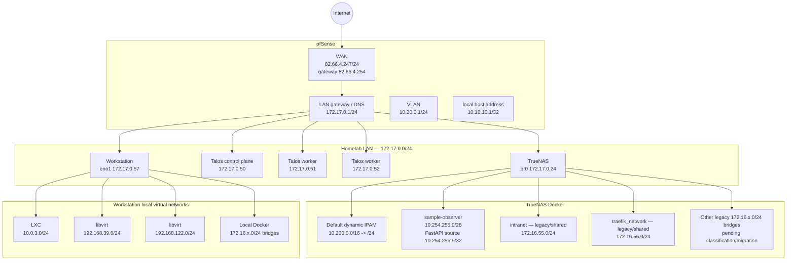

# Homelab network and IPAM topology

Last updated: 2026-09-11.

This document is the network/IPAM reference for the current homelab. It separates
stable routed/address contracts from dynamic Docker runtime allocations so that a
container redeploy does not accidentally turn an observed bridge address into a
long-lived infrastructure contract.

The 2026-09-11 TrueNAS Docker IPAM migration is tracked operationally in
[`truenas-docker-ipam-roadmap.md`](./truenas-docker-ipam-roadmap.md).

## Topology overview



## Stable routed and host address contracts

| Scope | Network / address | Key addresses | Contract |
| --- | --- | --- | --- |
| pfSense WAN | `82.66.4.0/24` | pfSense `82.66.4.247`, gateway `82.66.4.254` | Routed Internet edge |
| Homelab LAN | `172.17.0.0/24` | pfSense `.1`, TrueNAS `.24`, Talos `.50-.52`, workstation `.57` | Primary physical LAN; must never overlap Docker default IPAM |
| pfSense VLAN | `10.20.0.0/24` | pfSense `10.20.0.1` | Routed pfSense network |
| pfSense local host | `10.10.10.1/32` | pfSense `10.10.10.1` | Host/local address observed in pfSense routing table |
| FastAPI observer | `10.254.255.0/28` | gateway `.1`, FastAPI observer `.9` | Dedicated repository-owned Docker bridge; `.9/32` is the TrueNAS observer source contract |
| Workstation LXC | `10.0.3.0/24` | workstation bridge `.1` | Workstation-local virtualization |
| Workstation libvirt | `192.168.39.0/24` | workstation bridge `.1` | Workstation-local virtualization |
| Workstation libvirt | `192.168.122.0/24` | workstation bridge `.1` | Workstation-local virtualization |

The workstation and TrueNAS can both have Docker bridges named from the same
RFC1918 ranges. Those bridges are host-local L2 domains and must not be confused
with the routed homelab LAN. The IPAM selection still avoids all known host routes
to prevent ambiguous routing and future VPN/VLAN conflicts.

## TrueNAS Docker IPAM

### Current default pool

The default TrueNAS Docker IPv4 pool was migrated on 2026-09-11 from the
historical overlapping pool to:

```text
base = 10.200.0.0/16
size = /24
```

This provides up to 256 `/24` allocations for Docker-created bridge networks.
The IPv6 pool remains:

```text
base    = fdd0::/48
size    = /64
cidr_v6 = fdd0::/64
```

The live migration was accepted when all of the following were true:

- `docker.update` completed successfully through TrueNAS middleware;
- `docker.config.address_pools` reported `10.200.0.0/16,size=24` plus the
  existing `fdd0::/48,size=64` IPv6 pool;
- systemd reported `docker.service=active`;
- TrueNAS middleware `docker.status` converged from `FAILED` to `RUNNING`;
- a disposable Docker network without an explicit subnet received
  `10.200.1.0/24`, proving the default allocator uses the new pool;
- the host retained `br0=172.17.0.24/24` and
  `sample-observer=10.254.255.0/28`.

Immediately after the transition, runtime routes showed dynamic Docker bridges
from `10.200.0.0/24` through `10.200.7.0/24`. These are **observations, not
reservations**: application redeploys may remove, recreate or reassign them.
Do not encode a service dependency against one of these subnets unless that
service later receives an explicit reviewed network contract.

### Legacy/shared TrueNAS Docker networks

Existing Docker networks are not automatically renumbered merely because the
default address pool changes. The migration therefore intentionally retains
legacy `172.16.x.0/24` bridges until each network is classified and, where
appropriate, recreated in a reviewed batch.

Two legacy networks are explicit shared contracts and must not be removed by a
generic cleanup:

| Network | CIDR | Status / purpose |
| --- | --- | --- |
| `intranet` | `172.16.55.0/24` | Shared backend/service-discovery network; static-address and allowlist consumers must be audited before any renumbering |
| `traefik_network` | `172.16.56.0/24` | Shared external Traefik/ingress network; retain until all consumers are inventoried |

The remaining observed legacy range contains many historical TrueNAS/Compose
networks (`ix-*`, `nabla-*`, `wazuh_default`, `secrets-backend`, and others).
Their presence after the default-pool migration is not evidence that the new
IPAM failed. They are migration/cleanup candidates only after proving they have
no required live endpoints or repository contract.

Never run a blanket `docker network prune` as the migration mechanism.

## Workstation Docker and virtualization

The workstation is `172.17.0.57/24` on `eno1`. Its current local virtual routes
include:

| Runtime | Observed network |
| --- | --- |
| Docker default `bridge` | `172.16.0.0/24` |
| Docker `thiga-ai_default` | `172.16.1.0/24` |
| Docker `temporal-network` | `172.16.6.0/24` |
| Docker `intranet` | `172.16.7.0/24` |
| Docker `openclaw_default` | `172.16.8.0/24` |
| Docker `nabla-compose_default` | `172.16.9.0/24` |
| LXC `lxcbr0` | `10.0.3.0/24` |
| libvirt `virbr1` | `192.168.39.0/24` |
| libvirt `virbr0` | `192.168.122.0/24` |

These workstation Docker allocations are independent from TrueNAS Docker IPAM.
The fact that both hosts historically use `172.16.x.0/24` does not make those
bridges the same network.

## pfSense routing reference

The 2026-09-11 routing inventory is:

```text
default          -> 82.66.4.254       via mvneta0.4090
82.66.4.0/24     -> directly connected WAN
172.17.0.0/24    -> directly connected LAN, mvneta0.4091
10.20.0.0/24     -> directly connected VLAN, mvneta0.4092
10.10.10.1/32    -> local/loopback host address
1.1.1.1          -> 82.66.4.254
```

This inventory is part of the reason `10.200.0.0/16` is currently accepted as
the TrueNAS Docker default pool. Re-run the route inventory before expanding
VPNs, VLANs or routed RFC1918 ranges into `10.200.0.0/16`.

## Post-reboot persistence gate

The Docker IPAM change is not considered fully persistent until it survives a
normal TrueNAS reboot. This is intentionally a separate acceptance proof because
a previous operator observation suggested the address-pool setting may have
returned to the historical value after reboot.

After every TrueNAS reboot while this issue is being closed, run:

```bash
midclt call docker.config | jq -e '
  .pool == "cpool" and
  .dataset == "cpool/ix-apps" and
  (.address_pools | any(.base == "10.200.0.0/16" and .size == 24)) and
  (.address_pools | any(.base == "fdd0::/48" and .size == 64))
'

systemctl is-active docker
midclt call docker.status | jq

ip -4 route | grep -E '^(10\.200\.|10\.254\.255\.|172\.16\.|172\.17\.)'
```

Also run the repository preflight:

```bash
sudo bash scripts/truenas/migrate-docker-address-pool.sh --check
```

Acceptance requires:

1. `docker.config.address_pools` still contains `10.200.0.0/16,size=24` and
   must **not** have reverted to the historical `172.16.0.0/12`/reported
   `172.17.0.0/12` configuration;
2. `docker.service` is active and middleware `docker.status` is `RUNNING`;
3. `br0` remains `172.17.0.24/24` with default route via `172.17.0.1`;
4. `sample-observer` remains `10.254.255.0/28` and the FastAPI source contract
   remains `10.254.255.9/32`;
5. newly created/default Docker networks continue to allocate from
   `10.200.0.0/16`;
6. legacy/shared networks are neither silently deleted nor mistaken for current
   default-IPAM allocations.

If the address pool reverts after reboot, do **not** simply reapply it and close
the incident. Capture the boot-time middleware/config evidence first and find
why the persisted Docker datastore or boot environment restored the old value.

## IPAM rules

1. The physical homelab LAN `172.17.0.0/24` is reserved for physical hosts and
   Talos VMs; Docker default pools must not overlap it.
2. New/default TrueNAS Docker bridge allocation comes from `10.200.0.0/16`,
   divided into `/24` networks.
3. `sample-observer=10.254.255.0/28` and observer source
   `10.254.255.9/32` are explicit security/allowlist contracts.
4. `intranet=172.16.55.0/24` and `traefik_network=172.16.56.0/24` remain
   legacy shared contracts until their consumers are deliberately migrated.
5. Workstation-local Docker/LXC/libvirt ranges are not TrueNAS networks, but
   route inventory must still consider them before selecting routed/VPN ranges.
6. Do not introduce a pfSense VLAN/VPN/static route inside `10.200.0.0/16`
   without first migrating or shrinking the TrueNAS Docker pool.
7. Never infer service identity from a dynamically allocated Docker `/24`.
8. Never use broad network pruning as a substitute for endpoint/ownership
   classification and rollback evidence.
